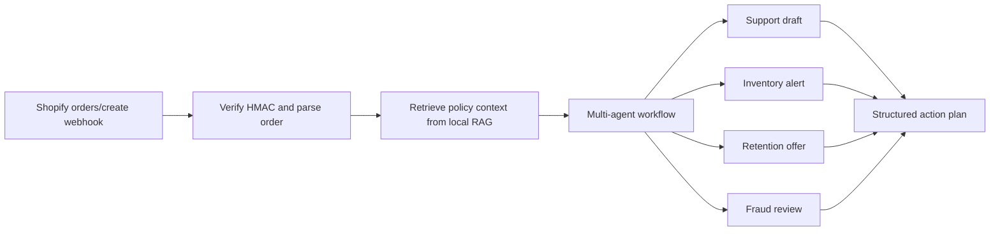

# Shopify AI Automation POC

Offline-first prototype for a Shopify/eCommerce automation system that uses a small multi-agent workflow plus local RAG to turn `orders/create` webhook payloads into support, inventory, retention, and risk actions.

The demo does not require API keys. It ships with deterministic mock AI so it can be tested anywhere. Real OpenAI, Gemini, Claude, or Sarvam calls can be added later behind provider adapters, but this repository intentionally keeps the POC safe and repeatable.

## What It Demonstrates

- Shopify webhook parsing and HMAC verification helper.
- Local RAG over store policies, VIP rules, inventory rules, and fraud review rules.
- Multi-agent orchestration:
  - Support agent drafts customer responses.
  - Inventory agent creates reorder alerts.
  - Marketing agent creates retention offers.
  - Risk agent flags high-risk orders.
- CLI demo and optional FastAPI webhook endpoint.
- Unit tests for retrieval, orchestration, and Shopify HMAC validation.

## Quick Start

```bash
python -m venv .venv
.venv\Scripts\activate
python -m pip install -e .
python -m shopify_ai_automation.cli
python -m unittest discover -s tests
```

On macOS/Linux, activate the virtual environment with:

```bash
source .venv/bin/activate
```

## Optional FastAPI Demo

```bash
python -m pip install -e .[api]
uvicorn shopify_ai_automation.api:app --reload
```

Then post a Shopify-like order payload to:

```text
POST http://127.0.0.1:8000/webhooks/shopify/orders-create
```

If `SHOPIFY_WEBHOOK_SECRET` is set, the endpoint validates `X-Shopify-Hmac-Sha256`. If it is not set, the endpoint runs in local demo mode.

## Repository Map

```text
src/shopify_ai_automation/
  agents.py          Specialist agents for support, inventory, marketing, risk
  ai.py              Offline mock AI engine and disabled external-provider guard
  api.py             Optional FastAPI webhook endpoint
  cli.py             Offline CLI demo
  orchestrator.py    Workflow coordinator
  rag.py             Local lexical RAG index
  shopify.py         Shopify event parsing and HMAC verification
samples/
  catalog.json       Demo stock and reorder points
  order_created.json Demo Shopify order payload
  policies.md        Local knowledge base
docs/
  research_report.md Tool comparison and production recommendation
  architecture.md    Workflow diagram and scaling notes
tests/
  test_*.py          Unit tests
```

## Architecture



## Demo Walkthrough

1. The sample Shopify order contains a VIP repeat customer, damaged-item note, and two products.
2. The RAG index retrieves the refund, VIP, and inventory policies.
3. Agents produce a customer support draft, inventory reorder alerts, and a loyalty offer.
4. The CLI returns JSON that could be sent to Shopify Admin, Zendesk/Gorgias, Slack, Klaviyo, or an operations queue.

## Documentation

- [Research and recommendation report](docs/research_report.md)
- [Architecture notes](docs/architecture.md)
- [Demo walkthrough](outputs/demo_walkthrough.md)

## Security Note

Do not commit real API keys. Use `.env` locally and rotate any key that has been pasted into chat, issue trackers, screenshots, or logs.
