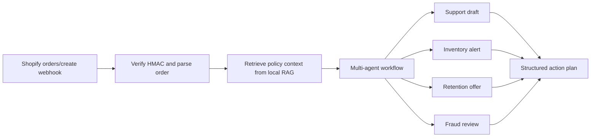

# Shopify AI Automation POC

Offline-first prototype for a Shopify/eCommerce automation system that uses a small multi-agent workflow plus local RAG to turn `orders/create` webhook payloads into support, inventory, retention, and risk actions.

The demo does not require API keys. It ships with deterministic mock AI so it can be tested anywhere. A Sarvam adapter is also available for live comparison when `SARVAM_API_KEY` is set.

## Demo

https://shopify-ai-automation.onrender.com/

## What It Demonstrates

- User-facing web dashboard for running and comparing automation results.
- Shopify webhook parsing and HMAC verification helper.
- Local RAG over store policies, VIP rules, inventory rules, and fraud review rules.
- Multi-agent orchestration:
  - Support agent drafts customer responses.
  - Inventory agent creates reorder alerts.
  - Marketing agent creates retention offers.
  - Risk agent flags high-risk orders.
- CLI demo and optional FastAPI webhook endpoint.
- Unit tests for retrieval, orchestration, and Shopify HMAC validation.

## Quick Start

```bash
python -m venv .venv
.venv\Scripts\activate
python -m pip install -r requirements.txt
uvicorn shopify_ai_automation.api:app --reload
```

Open the website:

```text
http://127.0.0.1:8000
```

Run tests:

```bash
python -m unittest discover -s tests
```

On macOS/Linux, activate the virtual environment with:

```bash
source .venv/bin/activate
```

CLI mode is still available:

```bash
python -m shopify_ai_automation.cli --provider mock --score
```

## Optional Sarvam Comparison

The default mock provider is best for repeatable local tests. To compare against Sarvam AI, set the key only in your local shell:

```bash
export SARVAM_API_KEY="your_key_here"
python -m shopify_ai_automation.cli --provider sarvam --score
```

PowerShell:

```powershell
$env:SARVAM_API_KEY="your_key_here"
python -m shopify_ai_automation.cli --provider sarvam --score
```

Live comparison on the sample order:

| Provider | Model | Actions | Support specificity | Actionable support reply | Quality score | Result |
| --- | --- | ---: | ---: | --- | ---: | --- |
| Mock/offline | deterministic rules | 4 | 3/6 | No | 22 | Stable and free, but support text is generic |
| Sarvam AI | `sarvam-105b` | 4 | 5/6 | Yes | 30 | Better draft quality with customer-specific next steps |

Sarvam produced the stronger result because it generated a ready-to-send support reply that named the customer, acknowledged the damaged item, asked for photo/order evidence, mentioned refund or replacement, and avoided auto-approving the refund.

## Optional Shopify Webhook Endpoint

Post a Shopify-like order payload to:

```text
POST http://127.0.0.1:8000/webhooks/shopify/orders-create
```

If `SHOPIFY_WEBHOOK_SECRET` is set, the endpoint validates `X-Shopify-Hmac-Sha256`. If it is not set, the endpoint runs in local demo mode.

## Render Deployment

This repo includes `render.yaml` and `requirements.txt`.

Render settings:

```text
Build command: pip install -r requirements.txt
Start command: uvicorn shopify_ai_automation.api:app --host 0.0.0.0 --port $PORT
```

Environment variables:

```text
AI_PROVIDER=mock
SARVAM_MODEL=sarvam-105b
SARVAM_API_KEY=your_rotated_key_here
SHOPIFY_WEBHOOK_SECRET=your_shopify_webhook_secret
```

Do not put API keys in GitHub. Add them only in Render's environment variable panel.

## Repository Map

```text
src/shopify_ai_automation/
  agents.py          Specialist agents for support, inventory, marketing, risk
  ai.py              Offline mock AI engine and optional Sarvam adapter
  api.py             ASGI website, API routes, and Shopify webhook endpoint
  cli.py             Offline CLI demo
  orchestrator.py    Workflow coordinator
  rag.py             Local lexical RAG index
  shopify.py         Shopify event parsing and HMAC verification
samples/
  catalog.json       Demo stock and reorder points
  order_created.json Demo Shopify order payload
  policies.md        Local knowledge base
docs/
  research_report.md Tool comparison and production recommendation
  architecture.md    Workflow diagram and scaling notes
tests/
  test_*.py          Unit tests
web/
  index.html         Browser dashboard
  app.js             Frontend API interactions
  styles.css         Responsive dashboard styling
```

## Architecture



## Demo Walkthrough

1. The sample Shopify order contains a VIP repeat customer, damaged-item note, and two products.
2. The RAG index retrieves the refund, VIP, and inventory policies.
3. Agents produce a customer support draft, inventory reorder alerts, and a loyalty offer.
4. The CLI returns JSON that could be sent to Shopify Admin, Zendesk/Gorgias, Slack, Klaviyo, or an operations queue.

## Documentation

- [Research and recommendation report](docs/research_report.md)
- [Architecture notes](docs/architecture.md)
- [Demo walkthrough](outputs/demo_walkthrough.md)

## Security Note

Do not commit real API keys. Use `.env` locally and rotate any key that has been pasted into chat, issue trackers, screenshots, or logs.
