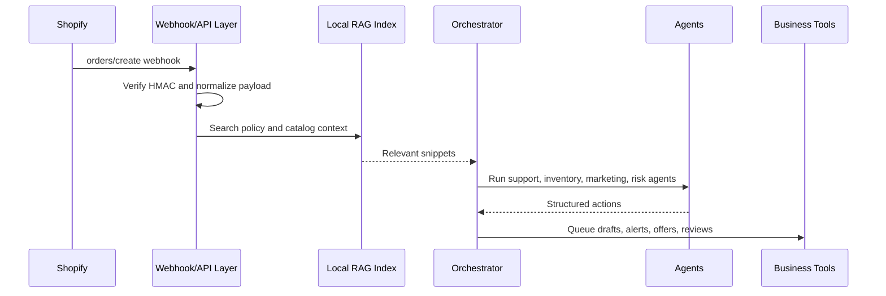

# Recommended Architecture

## POC Architecture

## Production Architecture

Use Shopify webhooks as the trigger, then put each webhook into a durable queue before AI processing. A worker should enrich the event with Shopify Admin API data, customer history, inventory, and policy context from a vector database. The LLM should return strict JSON with action type, confidence, evidence, and required human approval state.

Recommended production stack:

- Shopify webhooks and GraphQL Admin API for commerce data.
- FastAPI or a serverless function for webhook intake.
- Queue such as SQS, Cloud Tasks, Redis Queue, or Celery for retries and burst handling.
- Postgres for audit logs, action state, and human approvals.
- Vector store such as Pinecone, Weaviate, pgvector, or managed file search for policies and product knowledge.
- OpenAI or Gemini for low-cost default classification/drafting, with Claude reserved for complex support or long-context reasoning.
- n8n for fast business workflow integration when teams need visual automation and non-engineer ownership.

## Scaling Notes

Shopify webhooks should be acknowledged quickly and processed asynchronously. Shopify recommends webhooks as a near-real-time alternative to polling, while API calls should respect rate limits and retry responsibly. For GraphQL Admin API, Shopify uses calculated query costs, plan-specific restore rates, and a leaky-bucket model, so production enrichment should cache common product data and batch low-priority sync jobs.

## Human Approval

The safest production mode is "AI drafts, humans approve" for support replies, refunds, discounts, and fraud holds. Fully automatic actions are suitable for low-risk alerts such as inventory reorder notifications, internal analytics notes, and tagging.

## Cost Controls

- Use deterministic rules before LLM calls for simple inventory, VIP, and threshold decisions.
- Cache policy context and repeated prompt prefixes.
- Use cheaper models for classification and routing.
- Use premium models only for escalated support, complex fraud review, or high-value customers.
- Batch non-urgent jobs such as daily SEO copy suggestions or catalog enrichment.
